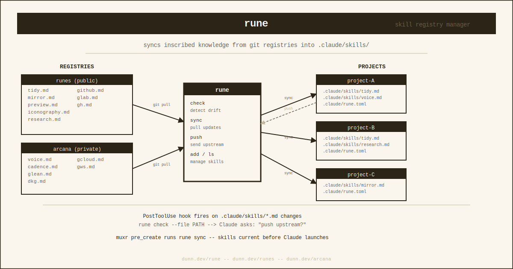
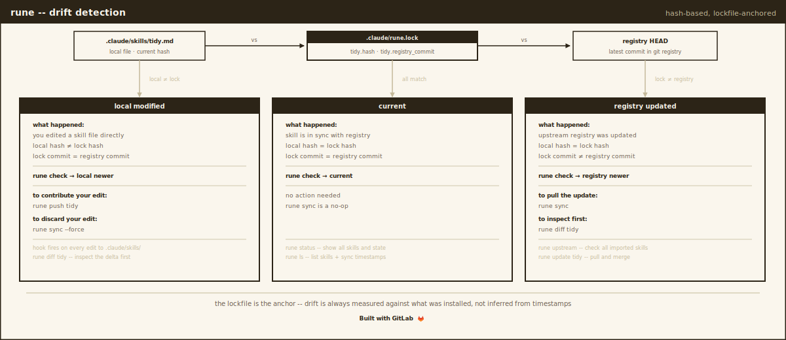

# rune

[](https://gitlab.com/nomograph/rune/-/pipelines)
[](LICENSE)
[](https://gitlab.com/nomograph/rune)

Registry manager for AI coding agent skills, agents, and rules. Syncs
markdown files from git-based registries into `.claude/skills/`,
`.claude/agents/`, and `.claude/rules/`.

## What this is

rune manages three types of items for AI coding agents:

- **Skills** -- reusable instructions that teach agents how to perform
  specific workflows. Stored in `.claude/skills/` as directories (with
  `SKILL.md`) or single `.md` files.
- **Agents** -- subagent definitions that delegate specialized tasks.
  Stored in `.claude/agents/` as `.md` files. (Anthropic's docs call
  these "subagents"; the directory is `.claude/agents/`, so rune uses
  "agents" to match the filesystem.)
- **Rules** -- conditional instructions that apply in specific contexts.
  Stored in `.claude/rules/` as `.md` files.

> Note: `.claude/commands/` was merged into skills by Anthropic in
> Claude Code v2.1.3. rune does not manage commands as a separate type.

rune keeps all three types current across projects via git-based registries.

- **Bidirectional sync** -- pull updates from registries, push changes back
- **Multi-registry** -- public and private registries with separate auth
- **Upstream tracking** -- import from third-party registries, track drift
- **Lockfile** -- reproducible syncs with content-hash drift detection
- **LLM-native** -- self-installs a Claude Code hook that detects drift

## Install

Install via [mise](https://mise.jdx.dev). See the
[latest release](https://gitlab.com/nomograph/rune/-/releases) for
the mise config block with current version and URLs.

## Quick start

```bash
rune setup                         # one-time: create config, install hook
rune init                          # per-project: create .claude/rune.toml
rune add tidy --from runes         # add a skill from a registry
rune add researcher -t agent       # add an agent
rune add no-emdash -t rule         # add a rule
rune sync                          # pull latest from registries
rune check                         # show drift between local and registries
rune push tidy                     # push local changes back to registry
rune status                        # combined summary view
rune audit                         # check for content regressions
```

## Registries

Registries are git repos containing typed subdirectories. Configure
them in `~/.config/rune/config.toml`:

```toml
# Public registry -- anyone can clone
[[registry]]
name = "runes"
url = "https://gitlab.com/nomograph/runes.git"

# Private registry -- requires authentication
[[registry]]
name = "private"
url = "https://gitlab.com/work-namespace/private-registry.git"
token_env = "RUNE_TOKEN_PRIVATE"
```

### Registry layout

A typed registry uses subdirectories for each item type:

```
my-registry/
  skills/
    tidy/
      SKILL.md
    voice.md
  agents/
    researcher.md
    reviewer.md
  rules/
    no-emdash.md
    commit-style.md
```

Legacy registries with skills at the root (no `skills/` subdirectory)
are still supported via automatic fallback.

### Teams

Use multiple registries to share items across teams:

```toml
# Team-wide skills and agents
[[registry]]
name = "team"
url = "https://gitlab.com/my-team/runes.git"
token_env = "RUNE_TOKEN_TEAM"

# Personal customizations
[[registry]]
name = "personal"
url = "https://gitlab.com/me/runes.git"

# Public upstream (read-only)
[[registry]]
name = "k-dense"
url = "https://github.com/K-Dense-AI/claude-scientific-skills.git"
readonly = true
source = "archive"
```

Registries are searched in declaration order. The first registry
containing an item wins (unless pinned in the manifest).

### Authentication

Registries on different GitLab/GitHub namespaces often need different
credentials. rune resolves tokens per-registry in this order:

1. **`token_env`** -- an env var name in the registry config. rune reads
   the variable at runtime and injects the token into the HTTPS URL.
   No secrets in config files.

2. **`glab auth token`** -- for gitlab.com URLs, rune tries the token
   from the `glab` CLI if installed and authenticated.

3. **`gh auth token`** -- for github.com URLs, rune tries the token
   from the `gh` CLI if installed and authenticated.

4. **No auth** -- falls through to system git credential helpers or
   public access.

#### Setting up a private registry

Create a fine-grained personal access token scoped to the registry
project with `Code: read` (and `write` if you'll `rune push`).

Set the token in your shell environment:

```bash
# In ~/.config/env/secrets.zsh or equivalent
export RUNE_TOKEN_PRIVATE="glpat-xxxxxxxxxxxx"
```

The naming convention is `RUNE_TOKEN_{REGISTRY_NAME}` in uppercase.

#### Multiple GitLab identities

If you have personal and work GitLab accounts, `glab auth token`
returns whichever account is active in glab. This may not match the
namespace your registry lives in. Use `token_env` to be explicit:

```toml
# Personal namespace -- glab auto-detect works
[[registry]]
name = "public-skills"
url = "https://gitlab.com/personal/skills.git"

# Work namespace -- needs explicit token
[[registry]]
name = "work-skills"
url = "https://gitlab.com/work-org/team/skills.git"
token_env = "RUNE_TOKEN_WORK"
```

## Per-project manifest

Each project declares what it needs in `.claude/rune.toml`:

```toml
[skills]
tidy = "runes"            # pinned to specific registry
research = {}             # resolved by registry priority
voice = "private"         # from private registry

[agents]
researcher = "runes"
reviewer = {}

[rules]
no-emdash = "runes"
```

Existing manifests with only `[skills]` continue to work unchanged.
The `[agents]` and `[rules]` sections are optional and omitted from
the file when empty.

### Path overrides

By default, rune installs items into `.claude/skills/`, `.claude/agents/`,
and `.claude/rules/`. Override these with a `[paths]` section to target
different tools:

```toml
[paths]
agents = ".cursor/agents"

[skills]
tidy = "runes"

[agents]
researcher = "runes"
```

After `rune sync`, a lockfile (`.claude/rune.lock`) records exactly
what was installed -- content hash, registry commit, and sync date.
This enables accurate drift detection:

- **Local newer** -- you edited the item since last sync
- **Registry newer** -- upstream changed since last sync
- **Diverged** -- both changed

## Upstream imports

Browse and import skills from third-party registries:

```bash
rune browse k-dense                 # list available items
rune browse k-dense -t skill        # list only skills
rune import scanpy@k-dense          # import into your own registry
rune upstream                       # check for upstream updates
rune diff scanpy                    # compare local vs upstream
rune update scanpy                  # pull upstream changes
```

Imported skills carry pedigree metadata tracking origin, upstream
commit, and whether you've modified them locally.

> import, upstream, diff, and update operate on skills only. They use
> pedigree metadata which is a skill-specific concept.

## Drift detection



rune installs a Claude Code PostToolUse hook that fires when a file
in `.claude/skills/`, `.claude/agents/`, or `.claude/rules/` is
modified. The hook runs `rune check` and surfaces drift to Claude as
context, prompting you to push or revert.

If you use [muxr](https://gitlab.com/nomograph/muxr) for session
management, add `rune sync` as a `pre_create` hook so items are
pulled before each session starts.

## Commands

| Command | Description |
|---------|-------------|
| `rune setup` | One-time: create config, install Claude Code hook |
| `rune init` | Per-project: create .claude/rune.toml manifest |
| `rune add <name...> [--all] [--from <reg>] [-t type]` | Add one or more items (or `--all` from a registry) |
| `rune remove <name> [-t type]` | Remove an item (type auto-detected if omitted) |
| `rune prune` | Remove manifest entries whose registry is not configured |
| `rune sync [--force]` | Pull latest from registries (--force overwrites local edits) |
| `rune check` | Show drift between local and registries |
| `rune push <name> [-t type]` | Push local changes back to registry |
| `rune ls` | List all items and their status |
| `rune ls --registry <name>` | List items available in a registry |
| `rune status` | Combined summary: registries + project + upstream |
| `rune audit` | Check for content regressions across registries |
| `rune browse <registry> [-t type]` | Browse items in a registry |
| `rune import <skill>@<registry>` | Import skill from upstream (skills only) |
| `rune upstream` | Check imported skills for upstream updates |
| `rune diff <skill>` | Diff imported skill against upstream |
| `rune update <skill>` | Pull upstream changes for an imported skill |
| `rune clean` | Remove stale cache entries |
| `rune doctor` | Diagnose configuration and registry health |
| `rune completions <shell>` | Generate shell completions (zsh, bash, fish) |

### Type flag

The `-t` / `--type` flag accepts `skill`, `agent`, or `rule`. For
`add`, it defaults to `skill`. For `remove` and `push`, the type is
auto-detected from the manifest when omitted.

### Global flags

| Flag | Description |
|------|-------------|
| `--offline` | Use cached registries, no network |
| `--dry-run` | Show what would change without mutating |
| `--project <dir>` | Target a different project directory |

---
Built in the Den by Tanuki and Andrew Dunn, April 2026.
